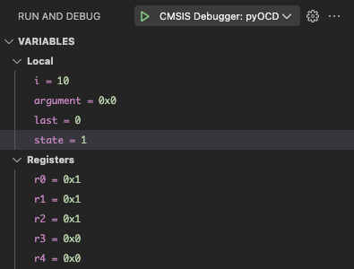

[](https://codeclimate.com/github/Open-CMSIS-Pack/vscode-cmsis-debugger/maintainability)
[](https://codeclimate.com/github/Open-CMSIS-Pack/vscode-cmsis-debugger/test_coverage)
[](https://securityscorecards.dev/viewer/?uri=github.com/Open-CMSIS-Pack/vscode-cmsis-debugger)

# Arm CMSIS Debugger

The Arm® CMSIS Debugger is an extension pack for Visual Studio Code® that demonstrates how to combine technologies from
various open source projects to create a comprehensive debug platform for Arm-based IoT solutions. It allows to install
multiple separate extensions together.

- [Arm CMSIS Debugger](#arm-cmsis-debugger)
    - [Included Extensions](#included-extensions)
    - [Recommended Extensions](#recommended-extensions)
    - [Debug Setup](#debug-setup)
    - [Start Debugging](#start-debugging)
    - [Flash and Run](#flash-and-run)
    - [Run and Debug view](#run-and-debug-view)
    - [Extension Functionality](#extension-functionality)
    - [Known Limitations and Workarounds](#known-limitations-and-workarounds)
    - [Related projects](#related-projects)
    - [Trademarks](#trademarks)

## Included Extensions

The following extensions are included in this extension pack:

- [CDT™ GDB Debug Adapter Extension](https://marketplace.visualstudio.com/items?itemName=eclipse-cdt.cdt-gdb-vscode),
an Eclipse CDT.cloud extension that supports debugging using GDB and any other debuggers that
supports the MI protocol.

- [Memory Inspector](https://marketplace.visualstudio.com/items?itemName=eclipse-cdt.memory-inspector), an Eclipse
CDT.cloud extension that provides a powerful and configurable memory viewer that works with debug adapters.

- [Peripheral Inspector](https://marketplace.visualstudio.com/items?itemName=eclipse-cdt.peripheral-inspector), an
EclipseCDT.cloud extension that provides a CMSIS SVD viewer and works with debug adapters.

## Recommended Extensions

We recommend to install the following extensions to improve the user experience:

- [Arm Tools Environment Manager](https://marketplace.visualstudio.com/items?itemName=Arm.environment-manager), an
extension that allows you to download, install, and manage software development tools using
[Microsoft® Vcpkg](https://vcpkg.io/en/index.html) artifacts. For example, use this extension to install the
[Arm GNU Toolchain](https://developer.arm.com/Tools%20and%20Software/GNU%20Toolchain) which comes with a GDB
variant for Arm CPUs.

- [Arm CMSIS Solution](https://marketplace.visualstudio.com/items?itemName=Arm.cmsis-csolution), an extension that
is a graphical user interface for csolution projects that use the
[CMSIS-Toolbox](https://open-cmsis-pack.github.io/cmsis-toolbox/). Use this extension to build your csolution
projects, to generate `*.cbuild-run.yml` debug configuration files, and to make use of contributed commands in
your debug launch configurations.

## Debug Setup

The debug setup requires a GDB installation supporting the GDB remote protocol and that can connect to a
GDB server like pyOCD.

We recommend to install the [`Arm GNU Toolchain`](https://developer.arm.com/Tools%20and%20Software/GNU%20Toolchain)
using the `Arm Tools Environment Manager` extension. It comes with `arm-none-eabi-gdb` which is used in the
Arm CMSIS Debugger default debug configurations.

### pyOCD Debug Setup

This extension includes a pyOCD distribution which is used by default.

If you wish to use a different pyOCD installation, enter the full path to the executable (including the file name)
in the `target`>`server` setting.

### SEGGER® J-LINK® Debug Setup

Install the latest
[J-LINK Software and Documentation Pack](https://www.segger.com/downloads/jlink/#J-LinkSoftwareAndDocumentationPack)
from [SEGGER](https://www.segger.com/). Ensure all required drivers and host platform specific settings are done.

The extension expects the installation folder to be on your system `PATH` environment variable. Alternatively, update
your debug configuration's `target`>`server` setting to contain the full path to the J-LINK GDB server executable
(including the file name).

## Start Debugging

There are two ways to start a debug session:

1. If you have installed the CMSIS Solution extension, in the **CMSIS view**
   , click on the **Debug** icon
   . Depending on the number of configurations in your
   `launch.json` file, you will be asked to select a configuration for the debug session.

2. In the **Run and debug view** , click the **Play** icon
   next to the selected debug connection . The debug starts with the
   selected configuration.

The debugger loads the application program and executes the startup code. When program execution stops (by default at
`main`), the source code opens at the next executable statement which is marked with a yellow arrow in the editor:


Most editor features are available in debug mode. For example, developers can use the Find command and can correct program
errors.

## Flash and Run

If you do not wish to enter a debug session, you can issue a flash download only, followed by a reset of the device.

In the **CMSIS view** , click on the **Run** icon
.

## Run and Debug view


The **Run and debug view**  differs from the other views in the
following aspects:

- [Debug toolbar](#debug-toolbar) is available.

- [VARIABLE section](#variables-section) is available.

- [WATCH section](#watch-section) is available.

- [CALL STACK section](#call-stack-section) is available.

- [BREAKPOINTS section](#breakpoints-section) is available.

- [Peripheral Inspector](#peripheral-inspector) is available (requires configuration).

- [Memory Inspector](#memory-inspector) can be opened.

- [Disassembly View](#disassembly-view) can be opened.

- [Debug Console](#debug-console) can be used to enter GDB commands.

> 📝 **Note:**  
> The following is using information from
> [Debug code with Visual Studio Code](https://code.visualstudio.com/docs/debugtest/debugging#_debugger-user-interface),
> [Eclipse CDT Cloud - Memory Inspector](https://github.com/eclipse-cdt-cloud/vscode-memory-inspector),
> [Eclipse CDT Cloud - Peripherals Inspector](https://github.com/eclipse-cdt-cloud/vscode-peripheral-inspector).

### Debug toolbar

Once a debug session starts, the **Debug toolbar** appears at the top of the window. The toolbar contains actions to
control the flow of the debug session, such as stepping through code, pausing execution, and stopping the debug
session.


The following table describes the actions available in the debug toolbar:

<!-- markdownlint-disable MD013 MD033 -->
| Action | Description |
|--------|-------------|
| Continue/Pause (F5) | **Continue**: Resume normal program/script execution (up to the next breakpoint).<br>**Pause**: Inspect code executing at the current line and debug line-by-line. |
| Step Over (F10) | Execute the next method as a single command without inspecting or following its component steps. |
| Step Into (F11) | Enter the next method to follow its execution line-by-line. |
| Step Out (Shift + F11) | When inside a method or subroutine, return to the earlier execution context by completing remaining lines of the current method as though it were a single command. |
| Restart (Shift + Ctrl/Cmd + F5) | Terminate the current program execution and start debugging again using the current run configuration. |
| Stop (Shift + F5) | Terminate the current program execution. |
<!-- markdownlint-enable MD013 MD033 -->
If your debugging sessions involve multiple targets (for example, a multi-core device), the debug toolbar shows the
list of sessions and lets you switch between them.

### VARIABLES section

During a debugging session, you can inspect variables, expressions, and registers in the **VARIABLES section** of the
**Run and Debug view** or by hovering over their source in the editor. Variable values and expression evaluation are
relative to the selected stack frame in the **CALL STACK section**. In case of multi-core, registers are relative to
the core that you are debugging.



To change the value of a variable during the debugging session, right-click on the variable in the
**VARIABLES section** and select **Set Value**.

You can use the **Copy Value action** to copy the variable's value, or the **Copy as Expression action** to copy an
iexpression to access the variable. You can then use this expression in the [**WATCH section**](#watch-section).

To filter variables by their name or value, use the Alt/Opt + Ctrl/Cmd + F keyboard shortcut while the focus is on the
**VARIABLES section**, and type a search term.


### WATCH section

Variables and expressions can also be evaluated and watched in the Run and Debug view's WATCH section.


### CALL STACK section

The **CALL STACK** sections shows objects that are currently on stack. Threads are shown for applications
that use an RTOS. Each object is associated to its location or value, and type.


The window content is updated automatically whenever program execution stops.

The context menu allows to:

- copy the call stack.

- open **Disassembly View**.

### BREAKPOINTS section

A breakpoint pauses the execution of your code at a specific point, so you can inspect the state of your
application at that point. VS Code supports several types of breakpoints.

#### Setting breakpoints

To set or unset a breakpoint, click on the editor margin or use **F9** on the current line.

- Breakpoints in the editor margin are normally shown as red filled circles.

- Disabled breakpoints have a filled gray circle.

- When a debugging session starts, breakpoints that can't be registered with the debugger change to a gray hollow
circle. The same might happen if the source is edited while a debug session without live-edit support is running.


For more control of your breakpoints, use the Run and Debug view's **BREAKPOINTS section**. This section lists all
breakpoints in your code and provides extra actions to manage them.


#### Breakpoint types

##### Conditional breakpoints

A powerful VS Code debugging feature is the ability to set conditions based on expressions, hit counts,
or a combination of both.

- Expression condition: The breakpoint is hit whenever the expression evaluates to true.

- Hit count: The hit count controls how many times a breakpoint needs to be hit before it interrupts execution.

- Wait for breakpoint: The breakpoint is activated when another breakpoint is hit ([triggered breakpoint](#triggered-breakpoints)).

To add a conditional breakpoint:

- Create a conditional breakpoint

    - Right-click in the editor margin and select Add Conditional Breakpoint.

    - Use the Add Conditional Breakpoint command in the Command Palette (⇧⌘P).

- Choose the type of condition you want to set (expression, hit count, or wait for breakpoint).


To add a condition to an existing breakpoint:

- Edit an existing breakpoint

    - Right-click on the breakpoint in the editor margin and select Edit Breakpoint.

    - Select the pencil icon next for an existing breakpoint in the **BREAKPOINTS section** of
    the **Run and Debug view**.

- Edit the condition (expression, hit count, or wait for breakpoint).

##### Triggered breakpoints

A triggered breakpoint is type of conditional breakpoint that is enabled once another breakpoint is hit. They can
be useful when diagnosing failure cases in code that happen only after a certain precondition.

Triggered breakpoints can be set by right-clicking on the glyph margin, selecting **Add Triggered Breakpoint**, and
then choosing which other breakpoint enables the breakpoint.


##### Inline breakpoints

Inline breakpoints are only hit when the execution reaches the column associated with the inline breakpoint.
This is useful when debugging minified code, which contains multiple statements in a single line.

An inline breakpoint can be set using **Shift + F9** or through the context menu during a debug session.
Inline breakpoints are shown inline in the editor.

Inline breakpoints can also have conditions. Editing multiple breakpoints on a line is possible through the
context menu in the editor's left margin.

##### Function breakpoints

Instead of placing breakpoints directly in source code, a debugger can support creating breakpoints by specifying
a function name. This is useful in situations where source is not available but a function name is known.

To create a function breakpoint, select the + button in the **BREAKPOINTS section** header and enter the function
name. Function breakpoints are shown with a red triangle in the **BREAKPOINTS section**.

##### Data breakpoints

If a debugger supports data breakpoints, they can be set from the context menu in the **VARIABLES section**. The Break
on Value Change/Read/Access commands add a data breakpoint that is hit when the value of the underlying variable
changes/is read/is accessed. Data breakpoints are shown with a red hexagon in the **BREAKPOINTS section**.

##### Logpoints

A logpoint is a variant of a breakpoint that does not interrupt into the debugger, but instead logs a message to the
debug console. Logpoints can help you save time by not having to add or remove logging statements in your code.

A logpoint is represented by a diamond-shaped icon. Log messages are plain text but can also include expressions to be
evaluated within curly braces ('{}').

To add a logpoint, right-click in the editor left margin and select Add Logpoint, or use the
**Debug: Add Logpoint...** command in the Command Palette (**Ctrl/Cmd + Shift + p**).


Just like regular breakpoints, logpoints can be enabled or disabled and can also be controlled by a condition
and/or hit count.

### PERIPHERAL Inspector

The Eclipse CDT Cloud **Periperhal Inspector** is a standalone SVD Viewer extension.


For more information, refer to the
[Peripheral Inspector GitHub repository](https://github.com/eclipse-cdt-cloud/vscode-peripheral-inspector).

### Memory Inspector

The Eclipse CDT Cloud **Memory Inspector** provides a powerful and configurable memory viewer that works with
debug adapters.


It features:

- Configurable Memory Display: Shows memory data with various display options.

- Address Navigation: Easily jump to and scroll through memory addresses.

- Variable Highlights: Colors memory ranges for variables.

- Multiple Memory Formats: Shows memory data on hover in multiple formats.

- Edit Memory: Allows in-place memory editing, if the debug adapter supports the WriteMemoryRequest.

- Memory Management: Enables saving and restoring memory data for specific address ranges (Intel Hex format).

- Customized Views: Create and customize as many memory views as you need.

- Lock Views: Keep views static, unaffected by updates from the debug session.

- Periodic Refresh: Automatically refresh the memory data.

- Multiple Debug Sessions: Switch between multiple debug sessions using a dropdown in the memory view.

For more information, refer to the
[Memory Inspector GitHub repository](https://github.com/eclipse-cdt-cloud/vscode-memory-inspector).

### Disassembly View

The **Disassembly View** shows the program execution in assembly code intermixed with the source code.

To open the **Disassembly View**:

- press **Ctrl/Cmd + Shift + p** and select "Open Disassembly View" or
- Right-click an item in the [**CALL STACK section**](#call-stack-section) and select "Open Disassembly View"


### Debug Console

The **Debug Console** enables viewing and interacting with the output of your code running in the debugger.
Expressions can
be evaluated with the **Debug Console REPL** (Read-Eval-Print Loop) feature.

With the CMSIS Debug extension, you can use the Debug Console REPL to enter
[GDB commands](https://sourceware.org/gdb/current/onlinedocs/gdb.html/index.html) while debugging. Before entering
a GDB command, you have to explicitly enter a "greater-than"-character `>` so that the following strings can be
evaluated as a GDB command.

Debug Console input uses the mode of the active editor, which means that it supports syntax coloring, indentation, auto
closing of quotes, and other language features.

<!-- markdownlint-disable-next-line MD036 -->
**Example**

The following example shows how to check the currently set breakpoints with the `> info break` command. Afterwards, the
application is run with the `> continue` command.


## Extension Functionality

This extension contributes additional functionality to work seamlessly with other extensions.

- The pseudo debugger types `cmsis-debug-pyocd` and `cmsis-debug-jlink`. These types allow a more seamless
integration into your IDE. However, these are not full debug adapters but generate debug configurations of
type `gdbtarget` which comes with the [CDT GDB Debug Adapter Extension](https://marketplace.visualstudio.com/items?itemName=eclipse-cdt.cdt-gdb-vscode).
- A [debug configuration provider](https://code.visualstudio.com/api/references/vscode-api#DebugConfigurationProvider)
for the type `gdbtarget` which comes with the [CDT GDB Debug Adapter Extension](https://marketplace.visualstudio.com/items?itemName=eclipse-cdt.cdt-gdb-vscode).
This provider automatically fills in default values for known remote GDB servers when launching a debug session.
- CMSIS specific launch configuration items for the `*` debugger type, i.e. visible for all debugger types.
It depends on the actually used debug adapter type if this information is known and utilized.

### Pseudo Debugger Types

This section describes the contributed pseudo debugger types and their support through the contributed debug
configuration provider for type `gdbtarget`.

#### CMSIS Debugger (pyOCD) - `cmsis-debug-pyocd`

The `cmsis-debug-pyocd` debugger type is used to add a debug configuration in the
`launch.json` file for debugging with GDB and pyOCD.  
This configuration uses the `gdbtarget` debugger type registered by the CDT GDB Debug Adapter Extension.

Additionally, the extension contributes a debug configuration resolver which automatically fills
the following gaps during debug launch:

- If option `target`>`server` is set to `pyocd`, then it expands to the absolute path of
 the built-in pyOCD distribution.
- Extends the `target`>`serverParameters` list of `pyocd` command line arguments:
    - Prepends `gdbserver` if not present.
    - Appends `--port <gdbserver_port>` if the `target`>`port` setting is set, where `<gdbserver_port>` gets
    that port setting's value.
    - Appends `--cbuild-run` and the corresponding `cbuildRunFile` path if `cmsis`>`cbuildRunFile` is set.

> 📝 **Note:**  
> The built-in version of pyOCD supports the command line option `--cbuild-run` which isn't available
> in releases outside this extension.

#### CMSIS Debugger (J-LINK) - `cmsis-debug-jlink`

The `cmsis-debug-jlink` debugger type is used to add a debug configuration in the launch.json file for debug
with GDB and the SEGGER J-LINK GDB server.  
This configuration uses the `gdbtarget` debugger type registered by the CDT GDB Debug Adapter Extension.

> 📝 **Note:**  
> The generated default debug configuration uses the value `JLinkGDBServer` as `target`>`server` setting.
> This executable has differing behavior on supported host platform:

- Linux and macOS: A GUI-less version of the GDB server is launched.
- Windows®: A GDB server with GUI is launched. Update `target`>`server` to `JLinkGDBServerCL` to launch a
 GUI-less version on Windows, too.

Additionally, the extension contributes a debug configuration resolver which automatically fills the following
gaps during debug launch:

- Extends the `target`>`serverParameters` list of `JLinkGDBServer`/`JLinkGDBServerCL` command line arguments:
    - Appends `--port <gdbserver_port>` if the `target`>`port` setting is set, where `<gdbserver_port>` gets that
    port setting's value.

## Known Limitations and Workarounds

### pyOCD fails to load `*.cbuild-run.yml` in the default configuration

When I use the default debug configuration for pyOCD, I get errors that pyOCD cannot find the solutions
`*.cbuild-run.yml` file.

**Possible Reasons**:

1. The application's CMSIS solution was initially built with a CMSIS-Toolbox version prior to v2.8.0 which is
the first version to generate `*.cbuild-run.yml` files.
1. You are using an [Arm CMSIS Solution](https://marketplace.visualstudio.com/items?itemName=Arm.cmsis-csolution) extension
prior to v1.52.0 which is the first version to fully support the `${command:cmsis-csolution.getCbuildRunFile}` command.

**Workarounds/Solutions**:

1. Update the CMSIS-Toolbox to the latest version. Additionally, you may have to run `cbuild setup --update-rte`
in a terminal for a first-time generation of `*.cbuild-run.yml` file in an existing workspace.
1. Update to Arm CMSIS Solution extension v1.52.0. Alternatively, replace
`${command:cmsis-csolution.getCbuildRunFile}` with the path to the `*.cbuild-run.yml` in your workspace
(`cmsis`>`cbuildRunFile` debug configuration setting).

### AXF files built with Arm Compiler 6 toolchain

When I download an AXF file built with Arm Compiler 6, I see the following warning and my application
does not execute correctly. This happens regardless of the selected GDB server.

```txt
warning: Loadable section "RW_RAM0" outside of ELF segments
  in /path/to/my/application.axf
```

**Possible Reason**: `arm-none-eabi-gdb` does not correctly load ELF program segments due to the way that
Arm Compiler 6 generates section and program header information when scatterloading is used.

**Workaround**: You can generate a HEX file for the program download, and the ELF file for debug purposes only.
The following steps are required if you build a [CSolution](https://open-cmsis-pack.github.io/cmsis-toolbox/build-overview/)-based
application with the [CMSIS-Toolbox](https://open-cmsis-pack.github.io/cmsis-toolbox/):

1. Edit the `*.cproject.yml` file(s) of your application.
1. Modify the [`output:type:`](https://open-cmsis-pack.github.io/cmsis-toolbox/YML-Input-Format/#output) node
to generate both an `elf` and a `hex` file:

```yml
  output:
    type:
      - elf
      - hex  
```

1. Build the solution.
1. Keep the default configuration's `program` setting as is.

```txt
"program": "${command:cmsis-csolution.getBinaryFile}",
```

1. Modify the default debug configuration's `initCommands` list, so that the `load` command gets the relative
path to the generated HEX file.

```json
"initCommands": [
    "load ./relative/path/to/my/application.hex",
    "break main"
],
```

This instructs the debugger to load the debug information from the ELF file and to use the HEX file
for program download.

### `arm-none-eabi-gdb` requires DWARF5 debug information

`arm-none-eabi-gdb` generates the following warnings when I debug ELF files with [DWARF](https://dwarfstd.org/) debug
information of standard version 4 and earlier. And the debug illusion seems to be broken in many places.  

```txt
warning: (Internal error: pc 0x8006a18 in read in CU, but not in symtab.)
```

**Possible Reason**: `arm-none-eabi-gdb` works best with DWARF debug information of standard version 5.

**Solution**: Make sure to build your application ELF file with DWARF version 5 debug information. Please refer to
your toolchain's user reference manual. This may require updates to all build tools like compiler and assembler.
For example use `-gdwarf-5` for `armclang`.

### Broken debug illusion

When debugging ELF files with [DWARF](https://dwarfstd.org/) debug information of standard version 4 and earlier,
`arm-none-eabi-gdb` generates the following warnings:

```txt
warning: (Internal error: pc 0x8006a18 in read in CU, but not in symtab.)
```

The debug illusion will be broken in many places.

**Possible Reason**: Missing DWARF5 debug information

`arm-none-eabi-gdb` works best with DWARF debug information of standard version 5.

**Solution**: Build the ELF file using DWARF5

Make sure to build your application ELF file with DWARF version 5 debug information.

### pyOCD port not available

When starting a debug session, you might see this error:


**Possible reason**: A running instance of pyOCD

This error might occur if a previous debug session has ended prematuerly and pyOCD has not exited. The orphaned instance
will still keep the port open (usually 3333) and thus you won't be able to open the port again in the new session.

**Solution**: Check open files and kill pyOCD

On Linux and macOS you can check the running open files using the [`lsof`](https://de.wikipedia.org/wiki/Lsof) command:

```sh
sudo lsof -i -n -P | grep 3333

Python    41836       user01    3u  IPv4 0xa6ef66ad5be49a4f      0t0    TCP *:3333 (LISTEN)
pyocd     41842       user01    8u  IPv4 0x9d09900145f3ca41
```

To kill the running pyOCD process, use:

```sh
sudo killall pyocd
```

On Windows systems, use the
[Windows Task Manager](https://learn.microsoft.com/en-us/troubleshoot/windows-server/support-tools/support-tools-task-manager)
or the [Process Explorer](https://learn.microsoft.com/en-us/sysinternals/downloads/process-explorer) to find orphaned
processes.

## Related projects

Related open source projects are:

- [Open-CMSIS-Pack](https://www.open-cmsis-pack.org/) of which this extension is part of.
- [Eclipse® CDT.cloud™](https://eclipse.dev/cdt-cloud/), an open-source project that hosts a number of components and
  best practices for building customizable web-based C/C++ tools.
- [pyOCD](https://pyocd.io/), a Python based tool and API for debugging, programming, and exploring Arm Cortex®
  microcontrollers.
- [GDB](https://www.sourceware.org/gdb/), the debugger of the GNU Project.

## Trademarks

- Arm and Cortex are registered trademarks of Arm Limited (or its subsidiaries or affiliates) in the US and/or
  elsewhere.
- Windows, Visual Studio Code, VS Code, and the Visual Studio Code icon are trademarks of Microsoft Corporation.
- Mac and macOS are trademarks of Apple Inc., registered in the U.S. and other countries and regions.  
- Eclipse, CDT, and CDT.cloud are trademarks of Eclipse Foundation, Inc.  
- SEGGER and J-LINK are registered trademarks of SEGGER Microcontroller GmbH.  
- Node.js is a registered trademark of the OpenJS Foundation.  
- GDB and GCC are part of the GNU Project and are maintained by the Free Software Foundation.  
