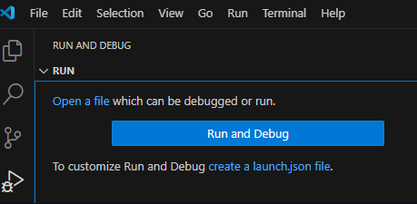
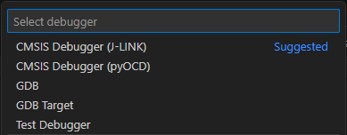

# Create a launch configuration

In Visual Studio Code, the `launch.json` configuration file connects a debug session to the target hardware via a debug
adapter. The following explains how to create the file for single- and multi-core devices using different debug adapters.

The pseudo debugger types `cmsis-debug-pyocd` and `cmsis-debug-jlink` are available to set up the debug connection in the
`launch.json` configuration file. However, these are not full debug adapters but generate debug configurations of type
`gdbtarget` which comes with the
[CDT GDB Debug Adapter Extension](https://marketplace.visualstudio.com/items?itemName=eclipse-cdt.cdt-gdb-vscode) that is
part of the Arm CMSIS Debugger extension pack.

!!! Note
    Using pyOCD, you can connect to the target via CMSIS-DAP and ST-LINK debug probes.

## Prerequisites

Make sure you have made the [required changes](./setup.md#project-setup) to your CMSIS Solution-based project.

If your project does not yet contain a `launch.json` file, create it as follows:

- Go to the **Rund and Debug view**.



- Click **create a launch.json file** link in the text. A quick-pick shows:



- Select **CMSIS Debugger (pyOCD)** or **CMSIS Debugger (J-LINK)**.

- This creates a new `launch.json` file under `.vscode` pre-filled with the selected default configuration.

## Debugging with pyOCD

For debugging with pyOCD, the following is added to the `launch.json` file:

```yml
{
    "configurations": [
        {
            "name": "CMSIS Debugger: pyOCD",
            "type": "gdbtarget",
            "request": "launch",
            "cwd": "${workspaceFolder}",
            "program": "${command:cmsis-csolution.getBinaryFile}",
            "gdb": "arm-none-eabi-gdb",
            "initCommands": [
                "load",
                "break main"
            ],
            "target": {
                "server": "pyocd",
                "port": "3333"
            },
            "cmsis": {
                "cbuildRunFile": "${command:cmsis-csolution.getCbuildRunFile}"
            }
        }
    ]
}
```

### Single-core (pyOCD)

For a single-core device, you need to add:

- the relative path to the HEX file to `"initCommands"` - `"load"`.

- an absolute `"definitionPath"` to the device's SVD file to be able to use the [Periperals view](./debug.md).

**Example**

```yml
{
    "configurations": [
        {
            "name": "CMSIS Debugger: pyOCD",
            "type": "gdbtarget",
            "request": "launch",
            "cwd": "${workspaceFolder}",
            "program": "${command:cmsis-csolution.getBinaryFile}",
            "gdb": "arm-none-eabi-gdb",
            "initCommands": [
                "load ./out/Blinky/B-U585I-IOT02A/Debug/Blinky.hex",
                "break main"
            ],
            "target": {
                "server": "pyocd",
                "port": "3333"
            },
            "cmsis": {
                "cbuildRunFile": "${command:cmsis-csolution.getCbuildRunFile}"
            }
            "definitionPath": "/Users/user/.cache/arm/packs/Keil/STM32U5xx_DFP/3.0.0/CMSIS/SVD/STM32U585.svd"
        }
    ]
}
```

### Multi-core (pyOCD)

For a multi-core device, you need to:

- for the boot core: add the relative path to the HEX files for both cores to `"initCommands"` - `"load"`.

- for the secondary core: comment out the  `"initCommands"`.

- for each core:

    - add an absolute `"definitionPath"` to the device's SVD file to be able to use the
      [Periperals view](./debug.md).

    - add the relative path to the AXF (ELF) files for each core to `"program"`.


**Example**

```yml
{
    "configurations": [
        {
            "name": "CM4: CMSIS Debugger: pyOCD",
            "type": "gdbtarget",
            "request": "launch",
            "cwd": "${workspaceFolder}",
            "program": "out/HelloWorld_cm4/FRDM-K32L3A6/Debug/HelloWorld_cm4.axf",
            "gdb": "arm-none-eabi-gdb",
            "initCommands": [
                "load out/HelloWorld_cm4/FRDM-K32L3A6/Debug/HelloWorld_cm4.hex",
                "load out/HelloWorld_cm0plus/FRDM-K32L3A6/Debug/HelloWorld_cm0plus.hex",
                "set $pc = Reset_Handler",
                "break main"
            ],
            "target": {
                "server": "pyocd",
                "port": "3333"
            },
            "cmsis": {
                "cbuildRunFile": "FRDM-K32L3A6.cbuild-run.yml"
            },
            "definitionPath": "/Users/user/.cache/arm/packs/NXP/K32L3A60_DFP/19.0.0/devices/K32L3A60/K32L3A60_cm4.xml"
        },
        {
            "name": "CM0+: CMSIS Debugger: pyOCD",
            "type": "gdbtarget",
            "request": "attach",
            "cwd": "${workspaceFolder}",
            "program": "out/HelloWorld_cm0plus/FRDM-K32L3A6/Debug/HelloWorld_cm0plus.axf",
            "gdb": "arm-none-eabi-gdb",
            // "initCommands": [
            //     "load",
            //     "break main"
            // ],
            "target": {
                "server": "pyocd",
                "port": "3334"
            },
            "definitionPath": "/Users/user/.cache/arm/packs/NXP/K32L3A60_DFP/19.0.0/devices/K32L3A60/K32L3A60_cm0plus.xml"
        }
    ]
}
```

!!! Note
    In this example, the `"set $pc = Reset_Handler",` is required to set the program counter to the correct value.

## Debugging with J-Link

For debugging with Segger J-Link (using the [J-Link GDB Server](https://kb.segger.com/J-Link_GDB_Server)), the following is
added to the `launch.json` file:

```yml
{
    "configurations": [
    {
        "name": "CMSIS Debugger: J-LINK",
        "type": "gdbtarget",
        "request": "launch",
        "cwd": "${workspaceFolder}",
        "program": "${command:cmsis-csolution.getBinaryFile}",
        "gdb": "arm-none-eabi-gdb",
        "initCommands": [
            "load",
            "break main"
        ],
        "target": {
            "server": "JLinkGDBServer",
            "serverParameters": [
                "-device",
                "${command:cmsis-csolution.getDeviceName}",
                "-endian",
                "little",
                "-if",
                "SWD",
                "-speed",
                "auto",
                "-noir",
                "-vd",
                "-nogui",
                "-localhostonly"
            ],
            "port": "3333"
        }
    }
    ]
}
```

### Single-core (J-Link)

For a single-core device, the configuration template contains all the information that is requires to start debugging.

!!! Attention
    **Check if the above statement is true!**

### Multi-core (J-Link)

For a multi-core device, you need to:

- change the `"-device"` entry to add processor names.

- create a `JLinkDevices.xml` file containing entries for all cores (refer to the
  [J-Link Device Support Kit documentation](https://kb.segger.com/J-Link_Device_Support_Kit) on how to do that).

- add the XML file to the `"serverParameters"` so that the Segger GDB server can pick them up.

**Example**

```yml
{
    "version": "0.2.0",
    "configurations": [
        {
            "name": "CMSIS Debugger: J-LINK",
            "type": "gdbtarget",
            "request": "launch",
            "cwd": "${workspaceFolder}",
            "program": "${command:cmsis-csolution.getBinaryFile}",
            "gdb": "arm-none-eabi-gdb",
            "initCommands": [
                "load",
                "break main"
            ],
            "target": {
                "server": "JLinkGDBServer",
                "serverParameters": [
                    "-device",
                    "${command:cmsis-csolution.getDeviceName}_${command:cmsis-csolution.getProcessorName}",
                    "-JLinkDevicesXmlPath",
                    ".alif/JLinkDevices.xml",
                    "-endian",
                    "little",
                    "-if",
                    "SWD",
                    "-speed",
                    "auto",
                    "-noir",
                    "-vd",
                    "-nogui",
                    "-localhostonly"
                ],
                "port": "3333"
            }
        }

    ]
}
```

For this example, the content of the `JLinkDevices.xml` file is as follows:

```xml
<DataBase>
  <Device>
    <ChipInfo Vendor="AlifSemiconductor" Name="AE722F80F55D5_HP" Aliases="AE722F80F55D5LS_M55_HP; AE722F80F55D5AS_M55_HP" />
  </Device>
  <Device>
    <ChipInfo Vendor="AlifSemiconductor" Name="AE722F80F55D5_HE" Aliases="AE722F80F55D5LS_M55_HE; AE722F80F55D5AS_M55_HE" />
  </Device>
</DataBase>
```