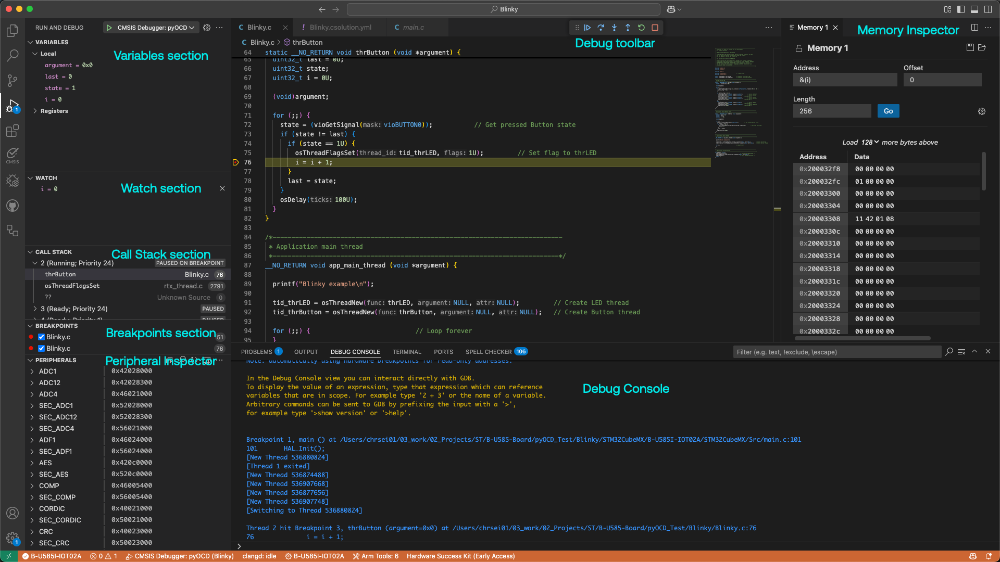
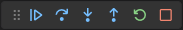
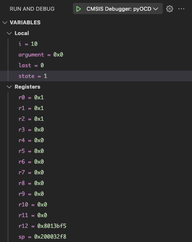
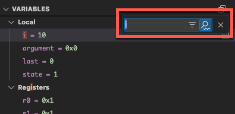
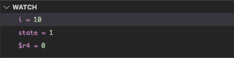
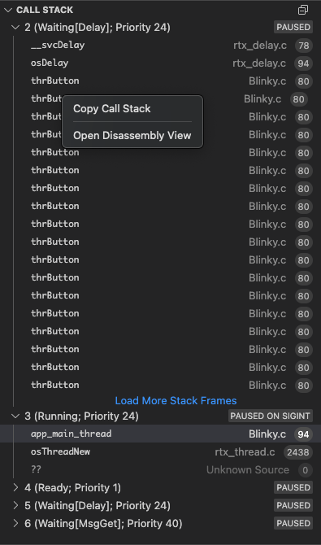
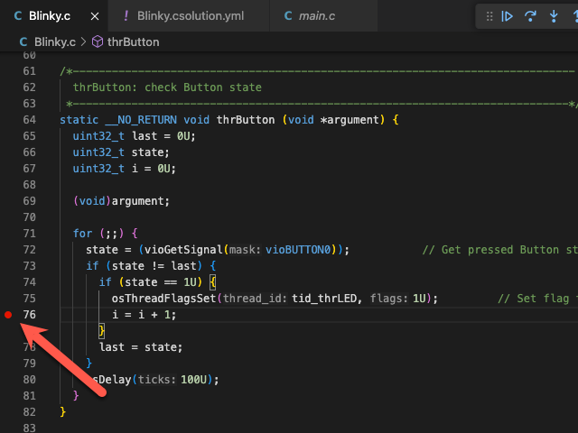
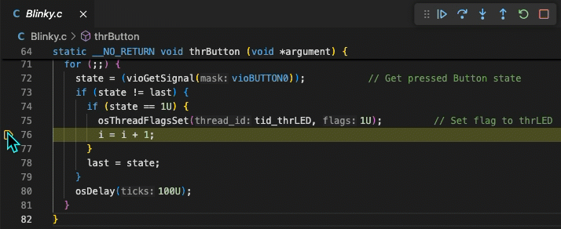
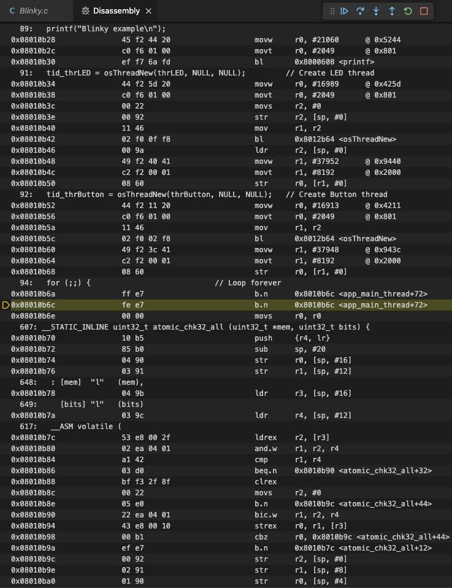

# Run and Debug view

The **Run and debug view**  differs from the other views in the
following aspects:

- [Debug toolbar](#debug-toolbar) is available.

- [VARIABLE section](#variables-section) is available.

- [WATCH section](#watch-section) is available.

- [CALL STACK section](#call-stack-section) is available.

- [BREAKPOINTS section](#breakpoints-section) is available.

- [Peripheral Inspector](#peripheral-inspector) is available (requires configuration).

- [Memory Inspector](#memory-inspector) can be opened.

- [Disassembly View](#disassembly-view) can be opened.

- [Debug Console](#debug-console) can be used to enter GDB commands.

!!! Note
    The following is using information from
    [Debug code with Visual Studio Code](https://code.visualstudio.com/docs/debugtest/debugging#_debugger-user-interface),
    [Eclipse CDT Cloud - Memory Inspector](https://github.com/eclipse-cdt-cloud/vscode-memory-inspector),
    [Eclipse CDT Cloud - Peripherals Inspector](https://github.com/eclipse-cdt-cloud/vscode-peripheral-inspector).

## Debug toolbar

Once a debug session starts, the **Debug toolbar** appears at the top of the window. The toolbar contains actions to
control the flow of the debug session, such as stepping through code, pausing execution, and stopping the debug
session.

The following table describes the actions available in the debug toolbar:

<!-- markdownlint-disable MD013 MD033 -->
| Action | Description |
|--------|-------------|
| Continue/Pause (F5) | **Continue**: Resume normal program/script execution (up to the next breakpoint). **Pause**: Inspect code executing at the current line and debug line-by-line. |
| Step Over (F10) | Execute the next method as a single command without inspecting or following its component steps. |
| Step Into (F11) | Enter the next method to follow its execution line-by-line. |
| Step Out (Shift + F11) | When inside a method or subroutine, return to the earlier execution context by completing remaining lines of the current method as though it were a single command. |
| Restart (Shift + Ctrl/Cmd + F5) | Terminate the current program execution and start debugging again using the current run configuration. |
| Stop (Shift + F5) | Terminate the current program execution. |
<!-- markdownlint-enable MD013 MD033 -->
If your debugging sessions involve multiple targets (for example, a multi-core device), the debug toolbar shows the
list of sessions and lets you switch between them.

## VARIABLES section

During a debugging session, you can inspect variables, expressions, and registers in the **VARIABLES section** of the
**Run and Debug view** or by hovering over their source in the editor. Variable values and expression evaluation are
relative to the selected stack frame in the **CALL STACK section**. In case of multi-core, registers are relative to
the core that you are debugging.

To change the value of a variable during the debugging session, right-click on the variable in the
**VARIABLES section** and select **Set Value**.

You can use the **Copy Value action** to copy the variable's value, or the **Copy as Expression action** to copy an
iexpression to access the variable. You can then use this expression in the [**WATCH section**](#watch-section).

To filter variables by their name or value, use the Alt/Opt + Ctrl/Cmd + F keyboard shortcut while the focus is on the
**VARIABLES section**, and type a search term.

## WATCH section

Variables and expressions can also be evaluated and watched in the Run and Debug view's WATCH section.

## CALL STACK section

The **CALL STACK** sections shows objects that are currently on stack. Threads are shown for applications
that use an RTOS. Each object is associated to its location or value, and type.

The window content is updated automatically whenever program execution stops.

The context menu allows to:

- copy the call stack.

- open **Disassembly View**.

## BREAKPOINTS section

A breakpoint pauses the execution of your code at a specific point, so you can inspect the state of your
application at that point. VS Code supports several types of breakpoints.

### Setting breakpoints

To set or unset a breakpoint, click on the editor margin or use **F9** on the current line.

- Breakpoints in the editor margin are normally shown as red filled circles.

- Disabled breakpoints have a filled gray circle.

- When a debugging session starts, breakpoints that can't be registered with the debugger change to a gray hollow
circle. The same might happen if the source is edited while a debug session without live-edit support is running.

For more control of your breakpoints, use the Run and Debug view's **BREAKPOINTS section**. This section lists all
breakpoints in your code and provides extra actions to manage them.

### Breakpoint types

#### Conditional breakpoints

A powerful VS Code debugging feature is the ability to set conditions based on expressions, hit counts,
or a combination of both.

- Expression condition: The breakpoint is hit whenever the expression evaluates to true.

- Hit count: The hit count controls how many times a breakpoint needs to be hit before it interrupts execution.

- Wait for breakpoint: The breakpoint is activated when another breakpoint is hit ([triggered breakpoint](#triggered-breakpoints)).

To add a conditional breakpoint:

- Create a conditional breakpoint

    - Right-click in the editor margin and select Add Conditional Breakpoint.

    - Use the Add Conditional Breakpoint command in the Command Palette (⇧⌘P).

- Choose the type of condition you want to set (expression, hit count, or wait for breakpoint).

To add a condition to an existing breakpoint:

- Edit an existing breakpoint

    - Right-click on the breakpoint in the editor margin and select Edit Breakpoint.

    - Select the pencil icon next for an existing breakpoint in the **BREAKPOINTS section** of
    the **Run and Debug view**.

- Edit the condition (expression, hit count, or wait for breakpoint).

#### Triggered breakpoints

A triggered breakpoint is type of conditional breakpoint that is enabled once another breakpoint is hit. They can
be useful when diagnosing failure cases in code that happen only after a certain precondition.

Triggered breakpoints can be set by right-clicking on the glyph margin, selecting **Add Triggered Breakpoint**, and
then choosing which other breakpoint enables the breakpoint.

#### Inline breakpoints

Inline breakpoints are only hit when the execution reaches the column associated with the inline breakpoint.
This is useful when debugging minified code, which contains multiple statements in a single line.

An inline breakpoint can be set using **Shift + F9** or through the context menu during a debug session.
Inline breakpoints are shown inline in the editor.

Inline breakpoints can also have conditions. Editing multiple breakpoints on a line is possible through the
context menu in the editor's left margin.

#### Function breakpoints

Instead of placing breakpoints directly in source code, a debugger can support creating breakpoints by specifying
a function name. This is useful in situations where source is not available but a function name is known.

To create a function breakpoint, select the + button in the **BREAKPOINTS section** header and enter the function
name. Function breakpoints are shown with a red triangle in the **BREAKPOINTS section**.

#### Data breakpoints

If a debugger supports data breakpoints, they can be set from the context menu in the **VARIABLES section**. The Break
on Value Change/Read/Access commands add a data breakpoint that is hit when the value of the underlying variable
changes/is read/is accessed. Data breakpoints are shown with a red hexagon in the **BREAKPOINTS section**.

#### Logpoints

A logpoint is a variant of a breakpoint that does not interrupt into the debugger, but instead logs a message to the
debug console. Logpoints can help you save time by not having to add or remove logging statements in your code.

A logpoint is represented by a diamond-shaped icon. Log messages are plain text but can also include expressions to be
evaluated within curly braces ('{}').

To add a logpoint, right-click in the editor left margin and select Add Logpoint, or use the
**Debug: Add Logpoint...** command in the Command Palette (**Ctrl/Cmd + Shift + p**).

Just like regular breakpoints, logpoints can be enabled or disabled and can also be controlled by a condition
and/or hit count.

## PERIPHERAL Inspector

The Eclipse CDT Cloud **Periperhal Inspector** is a standalone SVD Viewer extension.

For more information, refer to the
[Peripheral Inspector GitHub repository](https://github.com/eclipse-cdt-cloud/vscode-peripheral-inspector).

## Memory Inspector

The Eclipse CDT Cloud **Memory Inspector** provides a powerful and configurable memory viewer that works with
debug adapters.

It features:

- Configurable Memory Display: Shows memory data with various display options.

- Address Navigation: Easily jump to and scroll through memory addresses.

- Variable Highlights: Colors memory ranges for variables.

- Multiple Memory Formats: Shows memory data on hover in multiple formats.

- Edit Memory: Allows in-place memory editing, if the debug adapter supports the WriteMemoryRequest.

- Memory Management: Enables saving and restoring memory data for specific address ranges (Intel Hex format).

- Customized Views: Create and customize as many memory views as you need.

- Lock Views: Keep views static, unaffected by updates from the debug session.

- Periodic Refresh: Automatically refresh the memory data.

- Multiple Debug Sessions: Switch between multiple debug sessions using a dropdown in the memory view.

For more information, refer to the
[Memory Inspector GitHub repository](https://github.com/eclipse-cdt-cloud/vscode-memory-inspector).

## Disassembly View

The **Disassembly View** shows the program execution in assembly code intermixed with the source code.

To open the **Disassembly View**:

- press **Ctrl/Cmd + Shift + p** and select "Open Disassembly View" or
- Right-click an item in the [**CALL STACK section**](#call-stack-section) and select "Open Disassembly View"

## Debug Console

The **Debug Console** enables viewing and interacting with the output of your code running in the debugger.
Expressions can
be evaluated with the **Debug Console REPL** (Read-Eval-Print Loop) feature.

With the CMSIS Debug extension, you can use the Debug Console REPL to enter
[GDB commands](https://sourceware.org/gdb/current/onlinedocs/gdb.html/index.html) while debugging. Before entering
a GDB command, you have to explicitly enter a "greater-than"-character `>` so that the following strings can be
evaluated as a GDB command.

Debug Console input uses the mode of the active editor, which means that it supports syntax coloring, indentation, auto
closing of quotes, and other language features.

<!-- markdownlint-disable-next-line MD036 -->
**Example**

The following example shows how to check the currently set breakpoints with the `> info break` command. Afterwards, the
application is run with the `> continue` command.

